---
## Front matter
lang: ru-RU
title: Презентация к первой лабораторной работе
subtitle: Дисциплина: Операционные системы
author:
  - Дымова Д. Д.
institute:
  - Российский университет дружбы народов, Москва, Россия
  
date: 26 февраля 2024

## i18n babel
babel-lang: russian
babel-otherlangs: english

## Formatting pdf
toc: false
toc-title: Содержание
slide_level: 2
aspectratio: 169
section-titles: true
theme: metropolis
header-includes:
 - \metroset{progressbar=frametitle,sectionpage=progressbar,numbering=fraction}
 - '\makeatletter'
 - '\beamer@ignorenonframefalse'
 - '\makeatother'
---

## Объект и предмет исследования

Virtualbox и дистрибутив linux fedora-i3

## Цели и задачи

Цель: Приобрести технические навыки установки операционной системы на виртуальную машину.
Задачи: 
1. Скачать виртуальную машину
2. Установить операционную систему линукс с дистрибутивом fedora i3.

## Выполнение работы

Я запустила терминал, перешла в указанный каталог и создала каталог "id -un" (рис. @fig:001).
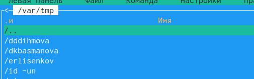{#fig:001 width=70%}

Открываю VB и настраиваю (рис. @fig:002).
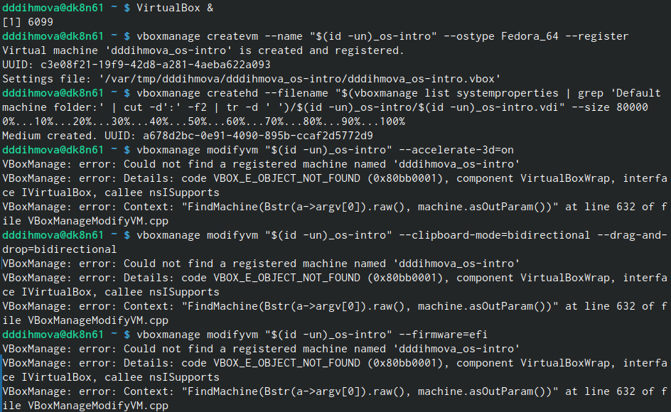{#fig:002 width=70%}

Переношу установочный образ (рис. @fig:003).
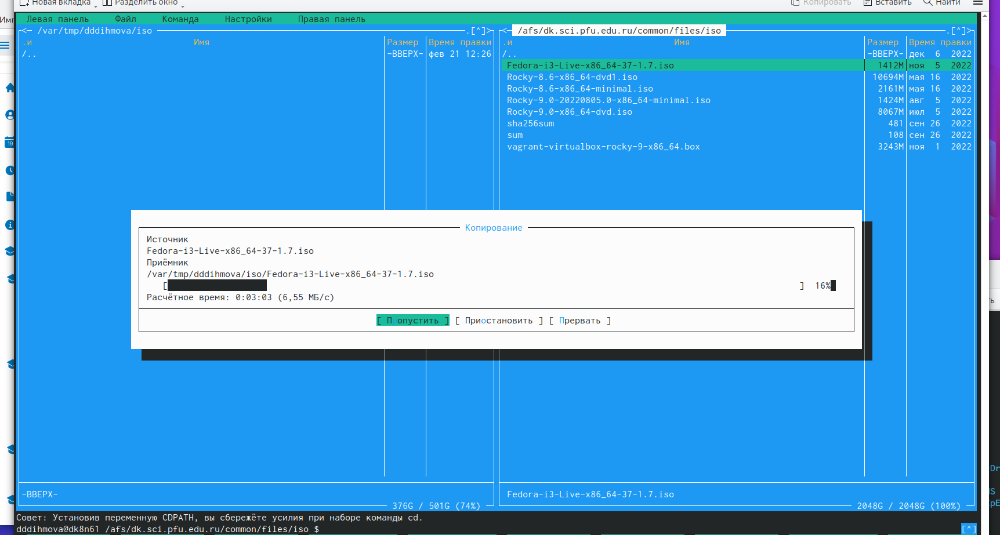{#fig:003 width=70%}

Создаю вирутальной машины (рис. @fig:002).
{#fig:002 width=70%}

Законченная настройка ВМ (рис. @fig:004).
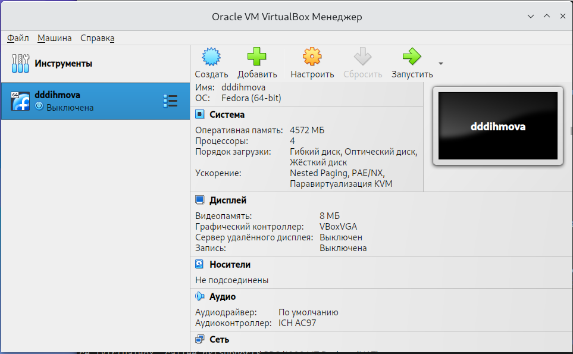{#fig:004 width=70%}

Провожу установку fedora-i3. Обновляю все пакеты с помощью команды dnf update (рис. @fig:005).
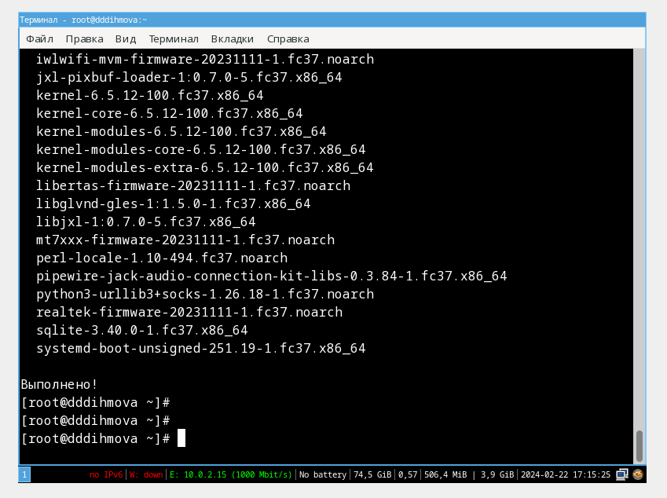{#fig:005 width=70%}

Провожу автоматическое обновление с помощью команды dnf install dnf-automatic (рис. @fig:006).
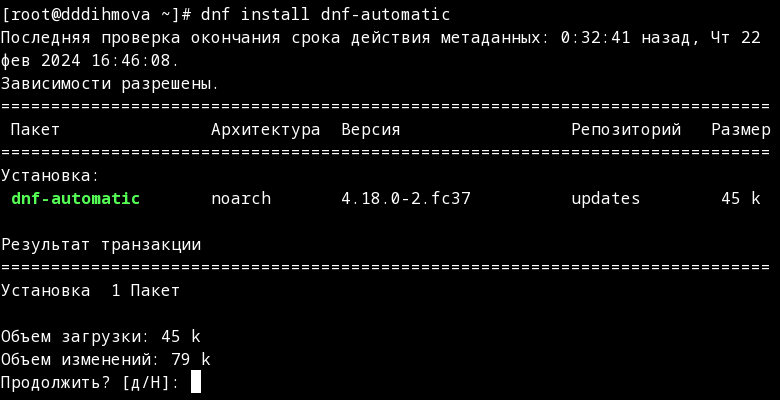{#fig:006 width=70%}

Запускаю таймер (рис. @fig:007).
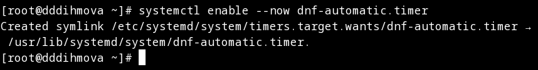{#fig:007 width=70%}

Устанавлива средства разработки (рис. @fig:008).
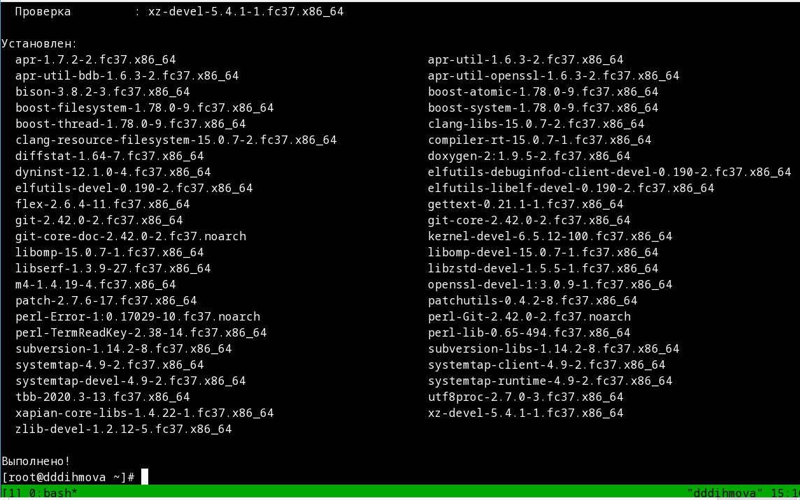{#fig:008 width=70%}

Устанавливаю dkms(рис. @fig:009).
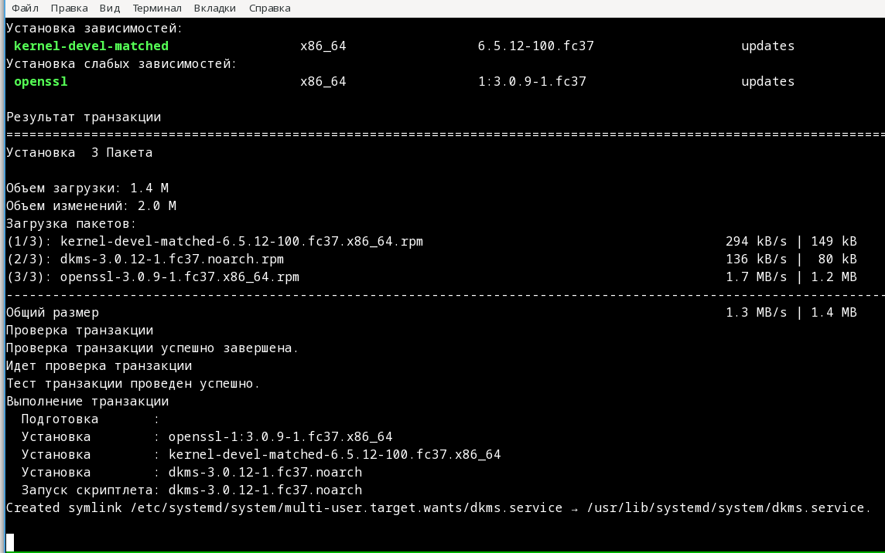{#fig:009 width=70%}

Подгрузить media не вышло(рис. @fig:010).
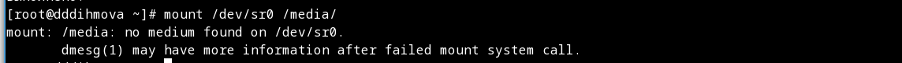{#fig:010 width=70%}

Создаю конфигурационный файл в указаном каталоге(рис. @fig:011).
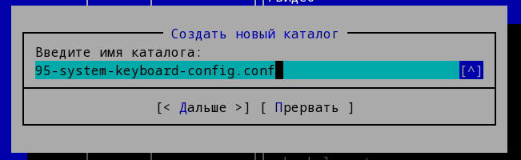{#fig:011 width=70%}

exec_always команда не сработала(рис. @fig:012).
{#fig:012 width=70%}

Устанавливаю pandoc (рис. @fig:013).
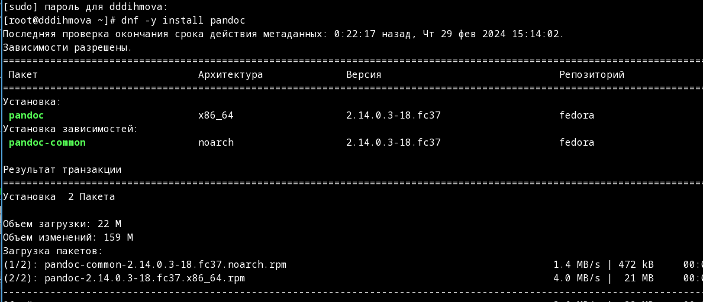{#fig:013 width=70%}

Устанавливаю Texlive (рис. @fig:014).
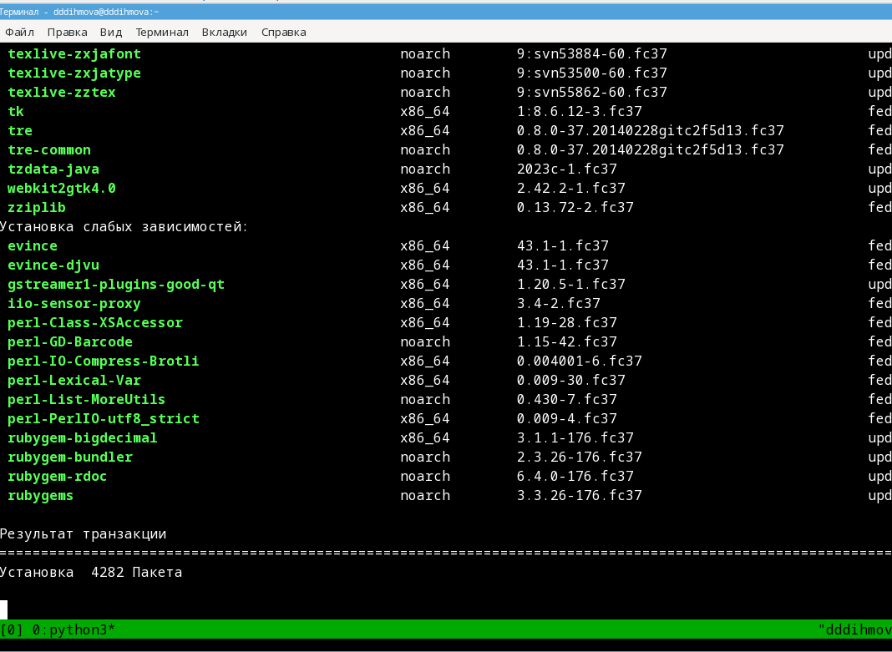{#fig:014 width=70%}

## Вывод

Я получила технические навыки установки ОС на виртуалку.

