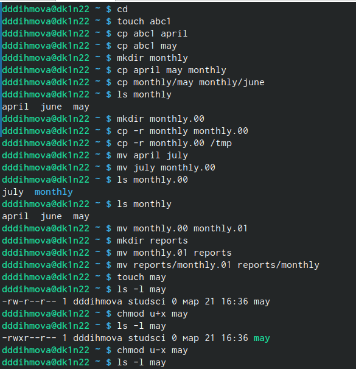
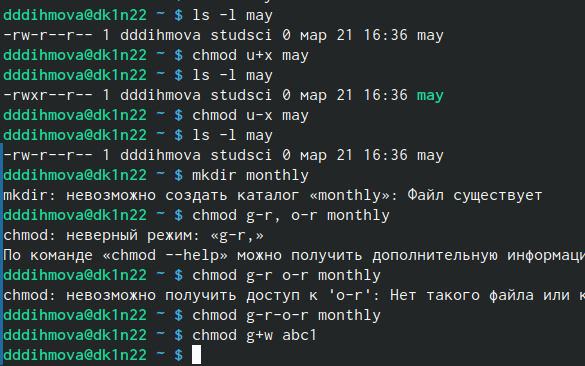
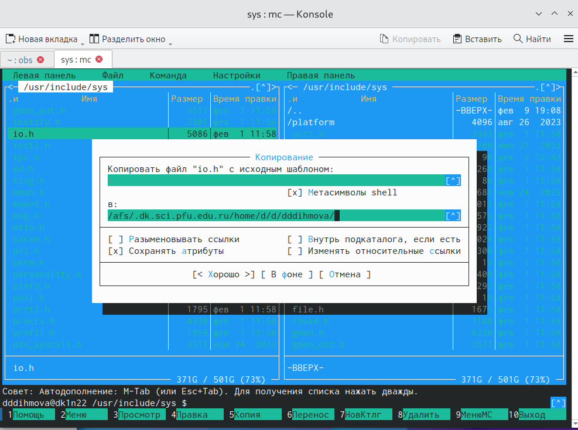
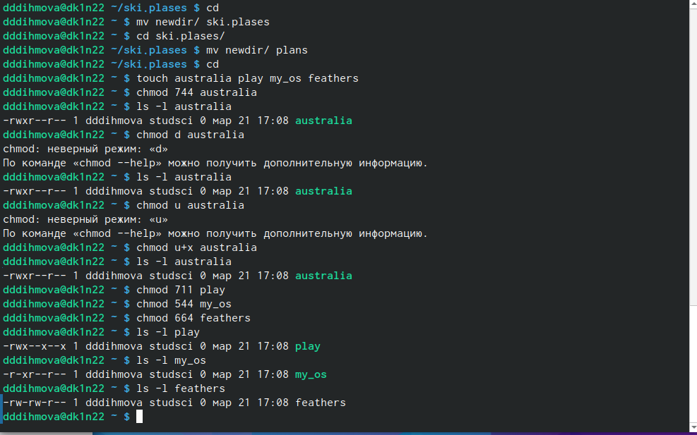

---
## Front matter
title: "Лабораторная работа №7"
subtitle: "Операционные системы"
author: "Дымовой Дианы"

## Generic otions
lang: ru-RU
toc-title: "Содержание"

## Bibliography
bibliography: bib/cite.bib
csl: pandoc/csl/gost-r-7-0-5-2008-numeric.csl

## Pdf output format
toc: true # Table of contents
toc-depth: 2
lof: true # List of figures
lot: true # List of tables
fontsize: 12pt
linestretch: 1.5
papersize: a4
documentclass: scrreprt
## I18n polyglossia
polyglossia-lang:
  name: russian
  options:
	- spelling=modern
	- babelshorthands=true
polyglossia-otherlangs:
  name: english
## I18n babel
babel-lang: russian
babel-otherlangs: english
## Fonts
mainfont: PT Serif
romanfont: PT Serif
sansfont: PT Sans
monofont: PT Mono
mainfontoptions: Ligatures=TeX
romanfontoptions: Ligatures=TeX
sansfontoptions: Ligatures=TeX,Scale=MatchLowercase
monofontoptions: Scale=MatchLowercase,Scale=0.9
## Biblatex
biblatex: true
biblio-style: "gost-numeric"
biblatexoptions:
  - parentracker=true
  - backend=biber
  - hyperref=auto
  - language=auto
  - autolang=other*
  - citestyle=gost-numeric
## Pandoc-crossref LaTeX customization
figureTitle: "Рис."
tableTitle: "Таблица"
listingTitle: "Листинг"
lofTitle: "Список иллюстраций"
lotTitle: "Список таблиц"
lolTitle: "Листинги"
## Misc options
indent: true
header-includes:
  - \usepackage{indentfirst}
  - \usepackage{float} # keep figures where there are in the text
  - \floatplacement{figure}{H} # keep figures where there are in the text
---

# Цель работы

Ознакомление с файловой системой Linux, её структурой, именами и содержанием каталогов. Приобретение практических навыков по применению команд для работы с файлами и каталогами, по управлению процессами (и работами), по проверке использования диска и обслуживанию файловой системы.

# Теоретическое введение

Для создания текстового файла можно использовать команду touch.
Формат команды:
touch имя-файла
Для просмотра файлов небольшого размера можно использовать команду cat.
Формат команды:
cat имя-файла
Для просмотра файлов постранично удобнее использовать команду less.
Формат команды:
less имя-файла

Команда cp используется для копирования файлов и каталогов.
Формат команды:
cp опции исходный_файл целевой_файл
Команды mv и mvdir предназначены для перемещения и переименования файлов
и каталогов.
Формат команды mv:
mv опции старый_файл новый_файл

Более подробно про Unix см. в [@tanenbaum_book_modern-os_ru; @robbins_book_bash_en; @zarrelli_book_mastering-bash_en; @newham_book_learning-bash_en].

# Выполнение лабораторной работы

Я выполнила все примеры из лабораторной работы (рис. @fig:001).

{#fig:001 width=70%}

Выполнению примеров (рис. @fig:002).

{#fig:002 width=70%}

Переношу файл io.h (рис. @fig:003).

{#fig:003 width=70%}

Выполнила задания 2-3 (рис. @fig:004).

{#fig:004 width=70%}

# Выводы

Я ознакомилась с файловой системой Линукс, её структурой, именами исодержанием каталогов, приобрела практические навыки по применению команд для работы с файлами и каталогами, по управлению процессами (и работами), по проверке использования диска и обслуживанию файловой системы. 

# Список литературы{.unnumbered}

::: {#refs}
:::

