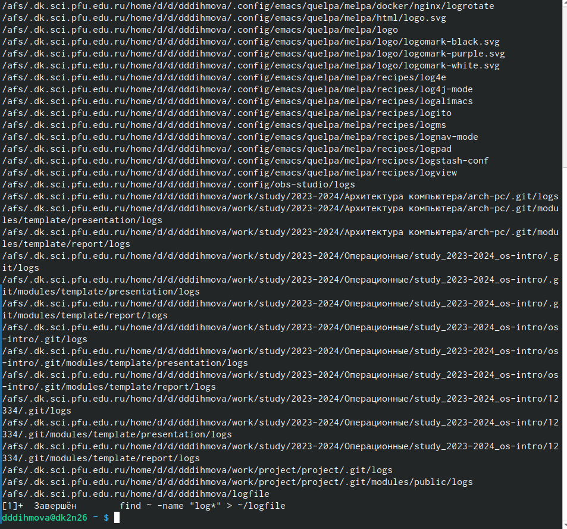

---
## Front matter
title: "Отчет по лабораторной работе №8"
subtitle: "Операционные системы"
author: "Дымова Диана"

## Generic otions
lang: ru-RU
toc-title: "Содержание"

## Bibliography
bibliography: bib/cite.bib
csl: pandoc/csl/gost-r-7-0-5-2008-numeric.csl

## Pdf output format
toc: true # Table of contents
toc-depth: 2
lof: true # List of figures
lot: true # List of tables
fontsize: 12pt
linestretch: 1.5
papersize: a4
documentclass: scrreprt
## I18n polyglossia
polyglossia-lang:
  name: russian
  options:
	- spelling=modern
	- babelshorthands=true
polyglossia-otherlangs:
  name: english
## I18n babel
babel-lang: russian
babel-otherlangs: english
## Fonts
mainfont: PT Serif
romanfont: PT Serif
sansfont: PT Sans
monofont: PT Mono
mainfontoptions: Ligatures=TeX
romanfontoptions: Ligatures=TeX
sansfontoptions: Ligatures=TeX,Scale=MatchLowercase
monofontoptions: Scale=MatchLowercase,Scale=0.9
## Biblatex
biblatex: true
biblio-style: "gost-numeric"
biblatexoptions:
  - parentracker=true
  - backend=biber
  - hyperref=auto
  - language=auto
  - autolang=other*
  - citestyle=gost-numeric
## Pandoc-crossref LaTeX customization
figureTitle: "Рис."
tableTitle: "Таблица"
listingTitle: "Листинг"
lofTitle: "Список иллюстраций"
lotTitle: "Список таблиц"
lolTitle: "Листинги"
## Misc options
indent: true
header-includes:
  - \usepackage{indentfirst}
  - \usepackage{float} # keep figures where there are in the text
  - \floatplacement{figure}{H} # keep figures where there are in the text
---

# Теоретическое введение

Большинство используемых в консоли команд и программ записывают результаты
своей работы в стандартный поток вывода stdout. Например, команда ls выводит в стан-
дартный поток вывода (консоль) список файлов в текущей директории. Потоки вывода
и ввода можно перенаправлять на другие файлы или устройства. Проще всего это делается
с помощью символов >, >>, <, <<. 

Более подробно про Unix см. в [@tanenbaum_book_modern-os_ru; @robbins_book_bash_en; @zarrelli_book_mastering-bash_en; @newham_book_learning-bash_en].

# Цель работы

Ознакомление с инструментами поиска файлов и фильтрации текстовых данных.
Приобретение практических навыков: по управлению процессами и заданиями, по
проверке использования диска и обслуживанию файловых систем.

# Выполнение лабораторной работы

Открыла консоль, записала в файл файлтхт названия файлов, содержащихся в каталоге етс и в домашнем каталоге, вывела имена всех файлов из файлтхт с расширением конф, записала их в конфтхт (рис. @fig:001).

{#fig:001 width=70%}

Запустила в фоновом режиме процесс, который записывает имена начинающиеся с лог в файл логфайл (рис. @fig:002).

{#fig:002 width=70%}

Завершение процесса (рис. @fig:003).
 
{#fig:003 width=70%}

Удалила указанный файл, запустила в фоновом режиме гедит (рис. @fig:004).

{#fig:004 width=70%}

Справка по команде дф (рис. @fig:006).

{#fig:006 width=70%}

Справка по команде дф (рис. @fig:007).

{#fig:007 width=70%}

С помощью команды find вывела имена всех директорий имеющихся в домашнем каталоге (рис. @fig:008).

{#fig:008 width=70%}

# Выводы

Я ознакомилась с инструментами поиска файлов и фильтрации текстовых данных. Приобрела практические навыки по управлению процессами, по проверке использования диска и обслуживанию файловых систем.

# Список литературы{.unnumbered}

::: {#refs}
:::
