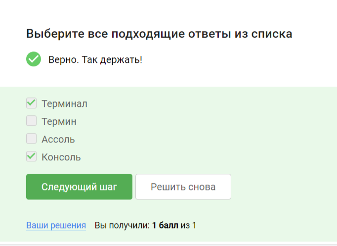
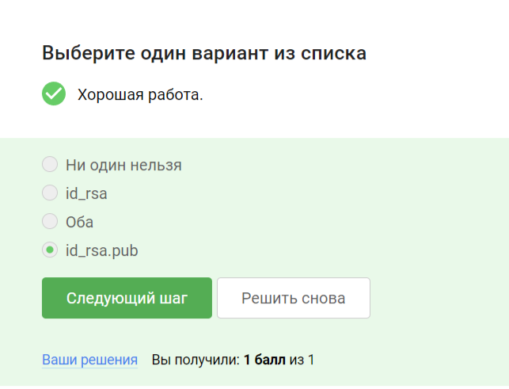

---
## Front matter
title: "Отчет по внешнему курсу"
subtitle: "Дисциплина: Операционные системы"
author: "Дымовой Д.Д."

## Generic otions
lang: ru-RU
toc-title: "Содержание"

## Bibliography
bibliography: bib/cite.bib
csl: pandoc/csl/gost-r-7-0-5-2008-numeric.csl

## Pdf output format
toc: true # Table of contents
toc-depth: 2
lof: true # List of figures
lot: true # List of tables
fontsize: 12pt
linestretch: 1.5
papersize: a4
documentclass: scrreprt
## I18n polyglossia
polyglossia-lang:
  name: russian
  options:
	- spelling=modern
	- babelshorthands=true
polyglossia-otherlangs:
  name: english
## I18n babel
babel-lang: russian
babel-otherlangs: english
## Fonts
mainfont: PT Serif
romanfont: PT Serif
sansfont: PT Sans
monofont: PT Mono
mainfontoptions: Ligatures=TeX
romanfontoptions: Ligatures=TeX
sansfontoptions: Ligatures=TeX,Scale=MatchLowercase
monofontoptions: Scale=MatchLowercase,Scale=0.9
## Biblatex
biblatex: true
biblio-style: "gost-numeric"
biblatexoptions:
  - parentracker=true
  - backend=biber
  - hyperref=auto
  - language=auto
  - autolang=other*
  - citestyle=gost-numeric
## Pandoc-crossref LaTeX customization
figureTitle: "Рис."
tableTitle: "Таблица"
listingTitle: "Листинг"
lofTitle: "Список иллюстраций"
lotTitle: "Список таблиц"
lolTitle: "Листинги"
## Misc options
indent: true
header-includes:
  - \usepackage{indentfirst}
  - \usepackage{float} # keep figures where there are in the text
  - \floatplacement{figure}{H} # keep figures where there are in the text
---
# Теоретическое введение

Большинство используемых в консоли команд и программ записывают результаты
своей работы в стандартный поток вывода stdout. Например, команда ls выводит в стан-
дартный поток вывода (консоль) список файлов в текущей директории. Потоки вывода
и ввода можно перенаправлять на другие файлы или устройства. Проще всего это делается
с помощью символов >, >>, <, <<. 

Более подробно про Unix см. в [@tanenbaum_book_modern-os_ru; @robbins_book_bash_en; @zarrelli_book_mastering-bash_en; @newham_book_learning-bash_en].

# Выполнение внешнего курса

Прохождение первого этапа курса (Введение в Линукс).

{#fig:001 width=70%}
{#fig:002 width=70%}
{#fig:003 width=70%}
{#fig:004 width=70%}
{#fig:005 width=70%}
{#fig:006 width=70%}
{#fig:007 width=70%}
{#fig:008 width=70%}
{#fig:009 width=70%}

Прохождение второго этапа (Работа на сервере).

{#fig:010 width=70%}
{#fig:011 width=70%}
{#fig:012 width=70%}
{#fig:013 width=70%}
{#fig:014 width=70%}
{#fig:015 width=70%}
{#fig:016 width=70%}
{#fig:017 width=70%}
{#fig:018 width=70%}
{#fig:019 width=70%}
{#fig:020 width=70%}
{#fig:021 width=70%}
{#fig:022 width=70%}
{#fig:023 width=70%}
{#fig:024 width=70%}
{#fig:025 width=70%}
{#fig:026 width=70%}
{#fig:027 width=70%}
{#fig:028 width=70%}

Прохождение третьего этапа (Продвинутые темы).

{#fig:011 width=70%}
{#fig:030 width=70%}
{#fig:031 width=70%}
{#fig:032 width=70%}
{#fig:033 width=70%}
{#fig:034 width=70%}
{#fig:035 width=70%}
{#fig:036 width=70%}
{#fig:037 width=70%}
{#fig:038 width=70%}
{#fig:039 width=70%}
{#fig:040 width=70%}
{#fig:041 width=70%}
{#fig:042 width=70%}
{#fig:043 width=70%}
{#fig:044 width=70%}
{#fig:045 width=70%}
{#fig:046 width=70%}
{#fig:047 width=70%}
{#fig:048 width=70%}
# Вывод

Я получила практические навыки по работе с линуксом. 
 
# Список литературы{.unnumbered}

::: {#refs}
:::
